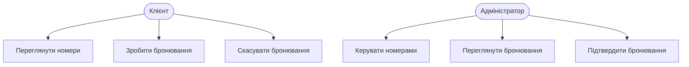
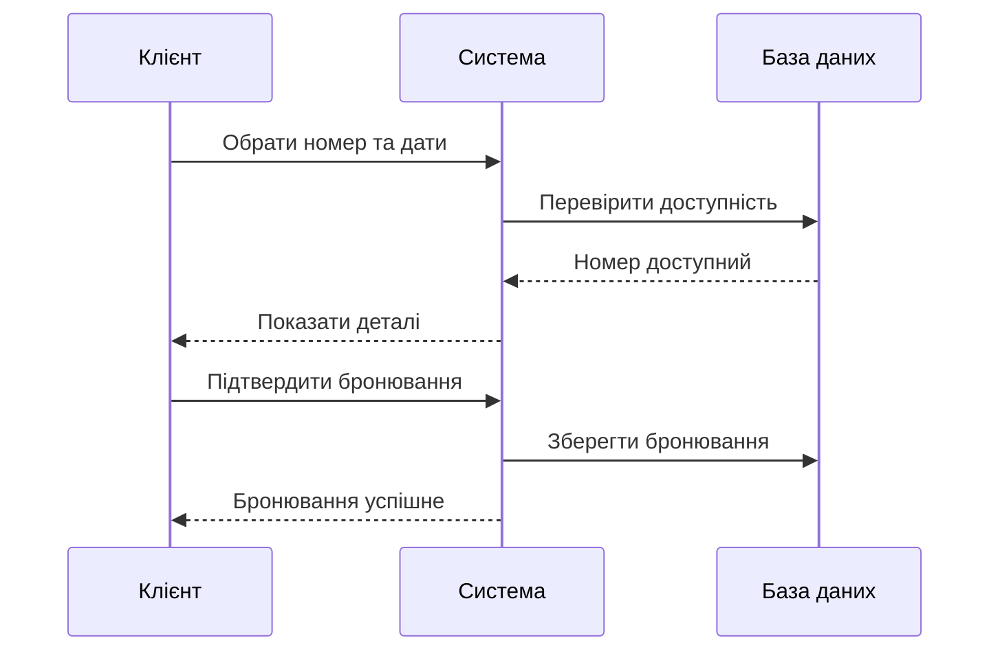
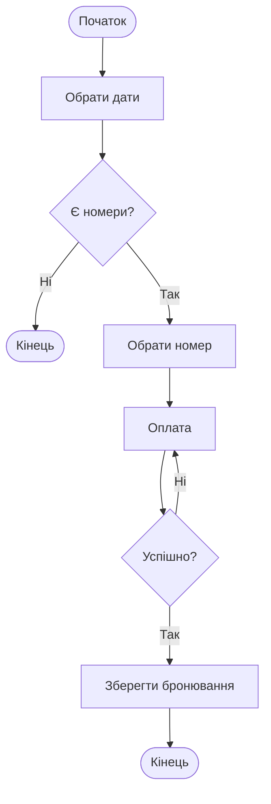

# Practical lesson: pz-UML

## Предметна область: Система бронювання готелю

## 1. Use Case Diagram

## 2. Sequence Diagram

## 3. Activity Diagram

## Опис діаграм

- **Use Case** - взаємодія Клієнта та Адміністратора з системою
- **Sequence** - послідовність повідомлень при бронюванні
- **Activity** - потік дій від вибору дат до підтвердження
